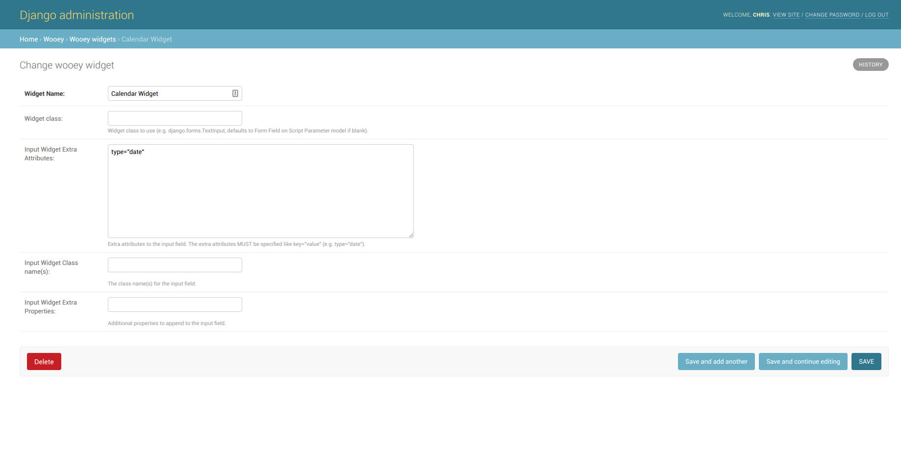
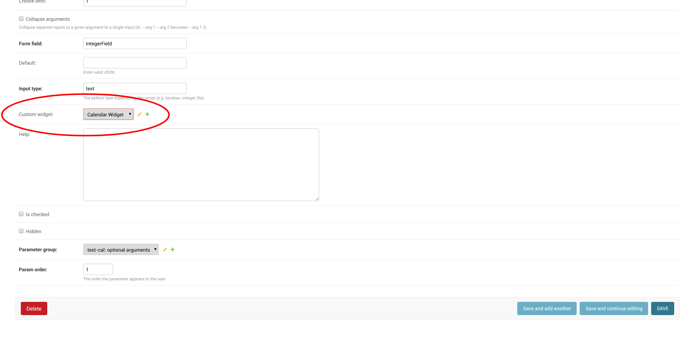

Scriptly Customizations
====================

Scriptly provides a number of ways to customize both the look and feel of Scriptly, with
the easiest mechanisms for customization being various :ref:`scriptly-configuration` settings.
Here, one can customize the site name, tag line, and other text throughout.

Form Widgets
------------

Advanced users can add custom form elements, which can be used for advanced input
elements such as a calendar. These can be set by creating a ScriptlyWidget via the
Scriptly admin page:

Widgets are made to be usable and generally useful components. As such, they need
to be associated with the form input elements in a separate step, which may be
accessed through the :ref:`script-parameters-admin` page within the Scriptly admin page. Here,
the widget to utilize for a given parameter can be set by associating a given
ScriptlyWidget with a Script Parameter:

